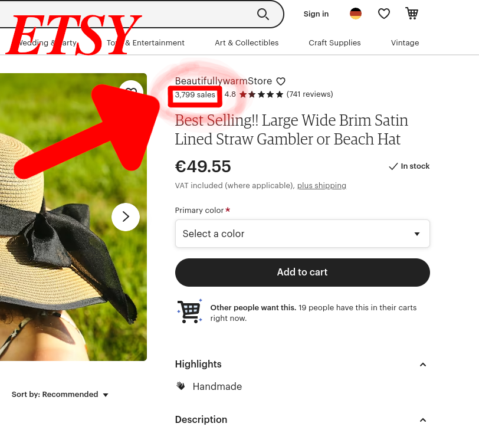

| [Home](../index.html) | [Erste Schritte](erste_schritte.html) | [Videos](videos.html) | [Webseiten](webseiten.html) | [Händler](händler.html) | [Trends finden](trends.html)
| - | - | - | - | - |  -
# Trends finden
## Auf Facebook
### [Facebook Ad Library](https://www.facebook.com/ads/library/?active_status=all&ad_type=political_and_issue_ads&country=CH&sort_data%5Bdirection%5D=desc&sort_data%5Bmode%5D=relevancy_monthly_grouped&media_type=all)
Auf der Facebook Ad Library findest du schon aufgeschaltete Werbeanzeigen auf Facebook. Es kann nach Land gefiltert werden und man sieht auch die echte Werbeanzeige. Kann auch genutzt werden um andere Facebook Seiten zu finden, die Ware auf Facebook verkaufen.

___

## Auf Etsy
### [Etsy](https://www.etsy.com)
Etsy ist ein online Shop wie Amazon oder Aliexpress. Hier kann man nach Produkten suchen. Suche nach Produkten, klick auf ein Produkt. Dann siehts du oben rechts wie oft es verkauft wurde. Etsy kann leider nicht nach verkäufen Sortieren.

